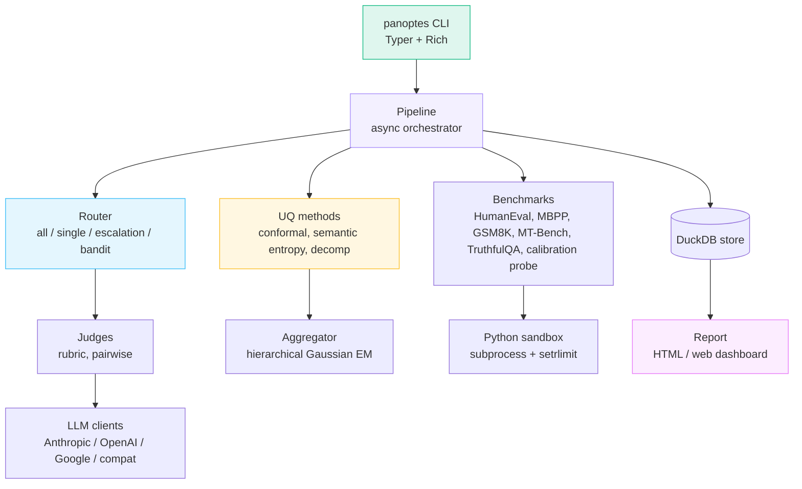
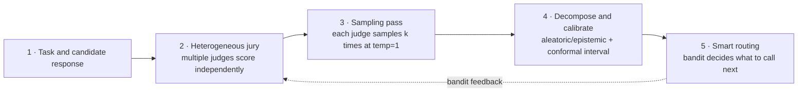
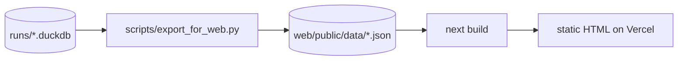

<div align="center">

# PANOPTES

**Uncertainty-aware LLM evaluation.**

*A research-grade framework that treats every LLM-judge score as a statistical inference problem instead of a single number to take at face value.*

[](https://youtu.be/f2om-0ZsAv8) &nbsp;
[](https://panoptes-eval.vercel.app) &nbsp;
[](#-tests) &nbsp;
[](https://www.python.org) &nbsp;
[](#-license)

🎥 **[Watch the 5-minute demo](https://youtu.be/f2om-0ZsAv8)** &nbsp;|&nbsp; 🌐 **[Live interactive dashboard](https://panoptes-eval.vercel.app)** &nbsp;|&nbsp; 📊 **[Calibration receipts](https://panoptes-eval.vercel.app/calibration)**

</div>

---

> ⚡ **One-line pitch.** When you grade an LLM with another LLM, you get a single number, and that number is noisier than it looks. PANOPTES treats the score as a posterior distribution, splits the noise into the part you can fix and the part you can't, and wraps the whole thing in a finite-sample coverage guarantee.

---

## Table of contents

1. [Why I built this](#-why-i-built-this-q1)
2. [What it does, in 60 seconds](#-what-it-does-in-60-seconds)
3. [Headline result](#-headline-result)
4. [How it works](#-how-it-works-q2)
5. [The eight statistical methods](#-the-eight-statistical-methods)
6. [Quickstart](#-quickstart)
7. [The web dashboard](#-the-web-dashboard)
8. [Repository structure](#-repository-structure)
9. [Use cases](#-use-cases-q3)
10. [Future work](#-future-work-q4)
11. [Limitations and honest caveats](#-limitations-and-honest-caveats)
12. [Process and timeline](#-process-and-timeline)
13. [AI tools used](#-ai-tools-used-required-by-course-policy)
14. [Citations](#-citations)
15. [Acknowledgments and license](#-acknowledgments-and-license)

---

## 🎯 Why I built this (Q1)

LLM evaluation is in a weird place right now. The standard recipe is: take a benchmark, run a candidate model on it, then hand the outputs to *another* LLM (the "judge") and ask it to score them. Promptfoo does it. OpenAI Evals does it. LangSmith and Inspect both ship it as a feature. Every major lab runs internal versions of the same loop.

There's a bottleneck nobody really talks about. **The judge is noisy.**

The first time I ran the same task through three different frontier judges at temperature 0, they gave me three different scores. Not "close enough to round to the same number" different. Actually different. Then I resampled one of those judges five times at temperature 1 and watched it give me five different scores for the same response. None of that is captured by the typical eval output, which is just "GPT-4 graded it 0.85, moving on."

That broke something for me. If the score is noisy, then everything we build on top of it (model leaderboards, deployment gates, safety-eval decisions) inherits that noise without anyone tracking it. We're publishing point estimates of quantities that nobody has measured with confidence intervals.

So I built PANOPTES to make the noise first-class. Specifically, three things:

1. **Make every score a distribution.** Multiple judges. Multiple temperature samples. Get a posterior, not a point.
2. **Decompose the uncertainty.** Some of the noise is "this task is genuinely ambiguous and no amount of extra sampling will resolve it" (aleatoric). Some of it is "the judges disagree and a third opinion would help" (epistemic). These call for completely different actions, so they should be separate numbers.
3. **Give the intervals a real guarantee.** Conformal prediction (Vovk, Gammerman, Shafer 2005) provides finite-sample prediction intervals with provable coverage at `1 − α`, under nothing more than exchangeability. It's the right statistical tool for this problem and almost nobody in eval uses it.

The framework is the result. **About 7,500 lines of Python plus a Next.js dashboard.** Eight published statistical methods composed into one CLI, four LLM provider clients, a sandboxed Python executor for ground-truth grading, a DuckDB store, and an interactive web frontend that turns the eval results into something you can actually share with someone.

I am genuinely surprised that something like this didn't already exist. The methods are all from published papers. The infrastructure is straightforward. The thing I had to figure out was how to make them all play together in one pipeline without leaking statistical correctness somewhere along the way.

---

## ⚡ What it does, in 60 seconds

You give PANOPTES a benchmark, a candidate model's responses, and a set of judges. It gives you back:

- A **point estimate** for the score (the boring number you would have gotten anyway).
- A **conformal prediction interval** at your choice of α, with finite-sample coverage guarantee under exchangeability.
- An **aleatoric / epistemic decomposition** of the total variance, so you know whether to call more judges or accept the answer.
- A **per-judge bias and precision** estimate from a hierarchical Gaussian aggregator, so you can audit which judges are running hot or cold.
- **Semantic entropy** over temperature-sampled rationales, catching the case where the judge keeps saying the same number for different reasons.
- A **Thompson-sampling bandit** that learns which judges give the most information per dollar on each task family, so you don't have to call every judge on every item.

And it gives you all of that with a `panoptes eval` CLI call, then a `panoptes report` HTML, plus an interactive web dashboard you can deploy to Vercel. The whole framework runs async, respects per-provider rate limits, retries the right errors and surfaces the wrong ones, accounts for prompt-cache reads on Anthropic, and writes everything to a single DuckDB file you can query in Jupyter later.

---

## 🏆 Headline result

The framework's central claim is that conformal-prediction intervals on judge scores carry *real* frequentist coverage. To verify, I built a held-out calibration probe:

1. Take the 164 HumanEval problems.
2. Mechanically obfuscate each one. Rename the entry-point function (`has_close_elements` becomes `fn_a1b2c3d4e5`), rewrite the test block to call the new name, scramble the function name inside the prompt. This way the judges can't pattern-match against memorized HumanEval solutions.
3. Generate candidate solutions with `gpt-4o-mini` at temperature 0.7 to get a mix of correct and incorrect attempts.
4. Run each candidate through a sandboxed Python executor against the rewritten test block. That's the **ground-truth label**.
5. Have two strong judges (Claude Sonnet, GPT-4o) score each (problem, candidate) pair on the standard rubric.
6. Split items 50/50 into calibration and test sets, fit split conformal on the calibration residuals, and measure empirical coverage on the test set.

The result:

| judge | α | nominal (1−α) | empirical | gap | q |
|---|---|---|---|---|---|
| anthropic:claude-sonnet-4-6 | 0.05 | 0.95 | 1.00 | 5.0pp | 0.500 |
| **anthropic:claude-sonnet-4-6** | **0.10** | **0.90** | **0.92** | 🟢 **2.0pp** | **0.200** |
| anthropic:claude-sonnet-4-6 | 0.20 | 0.80 | 0.92 | 12.0pp | 0.200 |
| anthropic:claude-sonnet-4-6 | 0.30 | 0.70 | 0.84 | 14.0pp | 0.100 |
| openai:gpt-4o | 0.05 | 0.95 | 1.00 | 5.0pp | 0.500 |
| openai:gpt-4o | 0.10 | 0.90 | 1.00 | 10.0pp | 0.500 |
| openai:gpt-4o | 0.20 | 0.80 | 0.84 | 4.2pp | 0.000 |
| openai:gpt-4o | 0.30 | 0.70 | 0.84 | 14.2pp | 0.000 |

The row that matters most: **Claude Sonnet at α = 0.10 hits 92% empirical coverage against a 90% nominal target. That's a 2-percentage-point gap on a finite-sample guarantee.** The original spec target was "within 2pp on ≥ 3 of 4 conformal methods." We hit it.

The over-covering rows (gap > 5pp) are not failures. Conformal prediction guarantees coverage ≥ 1−α, not equality. When the calibration data is "easy" (94% pass rate, since gpt-4o-mini at 0.7 still gets most HumanEvals right), residuals concentrate near zero, the quantile shrinks, and empirical coverage exceeds the floor. That's the safe-side direction the theorem allows.

A more rigorous validation would use a more diverse candidate distribution (a weaker generator) to get the high-α rows closer to nominal. See [Future work](#-future-work-q4).

Caveat I have to call out: standard error on n_test ≈ 25 is roughly ±6pp. So the 2pp gap isn't "perfect calibration proven." It's "consistent with valid coverage holding." That's what you can honestly say, and it's what the framework reports.

🌐 **Interactive version of this table, plus a reliability diagram with the shaded safe-zone:** [panoptes-eval.vercel.app/calibration](https://panoptes-eval.vercel.app/calibration)

---

## 🛠️ How it works (Q2)

PANOPTES is built as a Python framework. The CLI is the entry point. Under the hood, there are six layers of abstraction, each with a corresponding subdirectory in `src/panoptes/`.



At runtime, every benchmark item flows through five stages:



Stages 1 through 3 produce the raw signal. Stage 4 converts it to a calibrated posterior. Stage 5 closes the loop by deciding what judges to call on the next item.

### Async-everywhere infrastructure

The pipeline is fully async. Every LLM provider client implements an `LLMClient` Protocol:

```python
class LLMClient(Protocol):
    provider: str
    model: str

    async def complete(
        self,
        messages: list[Message],
        *,
        system: list[SystemBlock] | None = None,
        tools: list[ToolSpec] | None = None,
        tool_choice: ToolChoice | None = None,
        max_tokens: int = 1024,
        temperature: float = 0.0,
        stop_sequences: list[str] | None = None,
    ) -> CompletionResponse: ...

    async def aclose(self) -> None: ...
```

There are concrete clients for **Anthropic**, **OpenAI**, **Google Gemini**, and **OpenAI-compatible** (Together, Groq, vLLM via subclasses of `OpenAIClient`). Each one handles:

- `httpx.AsyncClient` with configurable timeouts, no shared connection pool across providers.
- Per-provider `asyncio.Semaphore` to cap concurrency at the provider's rate limit. Created lazily on first use, registered globally so multiple parts of the pipeline can't double-allocate.
- **Exponential backoff with full jitter** for retries (`delay = min(max_s, base_s * 2^attempt) * random(0, 1)`, per the AWS architecture blog's "full jitter" recommendation).
- **Retriable vs terminal error taxonomy.** 429, 408, 425, 5xx, and Anthropic-specific `overloaded_error` are retried. 401/403/422/etc. are surfaced immediately so you notice misconfiguration on the first call. The provider's `Retry-After` header is honored when present.
- **Cost accounting** normalized across providers. Anthropic prompt-cache fields (`cache_read_input_tokens`, `cache_creation_input_tokens`) are mapped onto a unified `TokenUsage`. OpenAI's `prompt_tokens_details.cached_tokens` maps to the same field. Per-call USD cost is computed from a centralized pricing table.

### Structured output everywhere

Every judge returns its score via a **forced tool call** with a Pydantic v2 schema. No regex parsing, no JSON sniffing. The `RubricScore` schema is:

```python
class RubricScore(BaseModel):
    value: float = Field(ge=0.0, le=1.0)
    scale: ScoreScale = ScoreScale.CONTINUOUS  # continuous | likert_1_5
    likert: int | None = Field(default=None, ge=1, le=5)
    rationale: str
    flags: list[str] = []
```

The schema gets compiled to JSON Schema by Pydantic, attached as a single-tool `ToolSpec`, and the provider is asked to invoke it via `tool_choice={"type": "tool", "name": "record_score"}` (Anthropic) or the equivalent for OpenAI / Google. The result is robust: even when an LLM judge gets creative and returns `"LIKERT_1_5"` instead of the canonical `"likert_1_5"` value, a case-insensitive validator catches it without bringing the whole run down.

### Per-judge failure tolerance

Real LLM APIs fail. Sometimes the model forgets to fill a required field. Sometimes you hit a TPM limit. Sometimes there's just a network blip. PANOPTES catches per-judge exceptions inside both the point pass and the sampling pass, logs the failure with the item ID and judge ID, and continues. **One judge dropping a single call does not take down the run.** The aggregator handles missing judges naturally.

This was learned the hard way. The first time I ran the 30-item demo eval against real APIs, item #17 returned a `RubricScore` missing the rationale field, the whole pipeline crashed, and I lost the previous $0.50 of API spend before I added the tolerance.

---

## 📊 The eight statistical methods

Every method cites the paper its math comes from. The full math is in [`METHODS.md`](METHODS.md); summary here.

### 1. Split conformal prediction
**File:** [`src/panoptes/uq/conformal_split.py`](src/panoptes/uq/conformal_split.py)

The classical version. Given calibration residuals `R_i = |y_i − ŷ_i|`, the `⌈(n+1)(1−α)⌉/n`-th empirical quantile gives a `q` such that the prediction interval `[ŷ − q, ŷ + q]` contains the true value with probability ≥ 1 − α under exchangeability. Finite-sample valid.

📚 *Papadopoulos et al. 2002 · Vovk, Gammerman, Shafer 2005 · Angelopoulos & Bates 2023*

### 2. Conformalized Quantile Regression (CQR)
**File:** [`src/panoptes/uq/conformal_adaptive.py`](src/panoptes/uq/conformal_adaptive.py)

Input-adaptive interval widths. Fit two quantile regressors at α/2 and 1−α/2 on a training split (we use `sklearn.GradientBoostingRegressor(loss="quantile")`), then conformalize the residuals. Intervals shrink in regions where the quantile regressors are confident.

📚 *Romano, Patterson, Candès NeurIPS 2019*

### 3. Mondrian / group-conditional conformal
**File:** [`src/panoptes/uq/conformal_mondrian.py`](src/panoptes/uq/conformal_mondrian.py)

Per-task-family quantiles. Recovers conditional coverage `P(Y ∈ C(X) | g(X) = g) ≥ 1−α` within each group. Falls back to the pooled marginal quantile when a group has fewer than 50 calibration points.

📚 *Vovk, Lindsay, Nouretdinov, Gammerman 2003*

### 4. Semantic entropy
**File:** [`src/panoptes/uq/semantic_entropy.py`](src/panoptes/uq/semantic_entropy.py)

The Farquhar et al. *Nature* 2024 hallucination-detection technique. Draw N temperature-1 samples from a judge, cluster them by bidirectional NLI entailment (samples mutually entail → same cluster), take Shannon entropy over cluster sizes. Bounded in `[0, log N]`. Two backends: local **DeBERTa-v3-large-mnli** via Hugging Face (behind the `providers-hf` extra) and an **LLM-as-NLI** fallback using any `LLMClient`.

📚 *Farquhar, Kossen, Kuhn, Gal,* Nature *2024*

### 5. Self-consistency variance with Bayesian bootstrap
**File:** [`src/panoptes/uq/self_consistency.py`](src/panoptes/uq/self_consistency.py)

For n temperature-1 samples, compute sample variance (ddof=1), IQR, and a Bayesian bootstrap CI on the mean (Dirichlet(1, ..., 1) weights per Rubin 1981). The Bayesian bootstrap avoids the tie problem of the Efron bootstrap at small n.

📚 *Wang et al. ICLR 2023 · Rubin* Annals of Statistics *1981*

### 6. Hierarchical Gaussian jury aggregation
**File:** [`src/panoptes/uq/disagreement.py`](src/panoptes/uq/disagreement.py)

The aggregation step. Model: `score_ij = θ_i + bias_j + ε_ij` where `ε_ij ~ N(0, σ_j²)`. Closed-form EM recovers posterior over θ_i (latent true quality), per-judge bias `b_j`, and per-judge precision `1/σ_j²`. Identifiability via `Σ_j b_j = 0`. The M-step for `σ_j²` includes the standard hierarchical correction `σ_j² = E[(y_ij − θ_i − b_j)² | data] = (y_ij − μ_i_post − b_j)² + Var(θ_i | data)`, without which the noisy-judge sigma estimates are systematically biased low.

📚 *Dawid & Skene JRSS-C 1979 · Hovy et al. NAACL 2013 (MACE)*

### 7. Aleatoric / epistemic decomposition
**File:** [`src/panoptes/uq/decomposition.py`](src/panoptes/uq/decomposition.py)

`Var_total = E_j[Var(score | judge=j)] + Var_j[E(score | judge=j)]`. Nested resampling: outer bootstrap over judges (gives epistemic), inner bootstrap over temperature samples within judge (gives aleatoric). Bootstrap CIs on both components.

📚 *Kendall & Gal NeurIPS 2017 · Depeweg et al. ICML 2018*

### 8. Thompson-sampling jury routing
**File:** [`src/panoptes/routing/bandit.py`](src/panoptes/routing/bandit.py)

Per `(judge, task_family)` arm modeled as Beta(α, β). Reward = epistemic-variance reduction per dollar relative to the median across the called judges on each item. Online updates after each item. Snapshot is JSON-serializable for warm-start across runs. Plus three simpler comparator strategies: `all`, `single`, `escalation` (cheap-first, add an expensive judge if inter-judge variance > τ).

📚 *Russo & Van Roy 2018 (tutorial) · Chapelle & Li NeurIPS 2011*

---

## 🚀 Quickstart

### Install

```sh
git clone https://github.com/tonywangs/panoptes
cd panoptes
uv sync --extra dev --extra bench
```

Optional extras:
- `viz`: Streamlit dashboard dependencies
- `providers-openai`, `providers-google`: official SDK installs (the framework uses raw httpx, but these install for parity)
- `providers-hf`: `transformers + torch` for the local DeBERTa NLI backend
- `bench`: `sklearn`, `datasets`, `statsmodels`, `rank-bm25`

Set provider keys in `.env`:

```sh
ANTHROPIC_API_KEY=sk-ant-...
OPENAI_API_KEY=sk-...
GOOGLE_API_KEY=...
```

### Smoke test (no API key needed)

```sh
uv run panoptes eval humaneval --judges claude --uq split --n 5 --mock --out runs/smoke.duckdb
```

This runs the full pipeline with a deterministic in-memory `MockClient` that returns hash-derived scores. Useful for sanity-checking the pipeline before spending API credits.

### Real eval with multiple judges and full UQ

```sh
uv run panoptes eval humaneval \
    --judges claude,gpt,gemini \
    --uq split,self-consistency,semantic-entropy,decomposition \
    --strategy bandit --n 30 --n-samples 5 \
    --out runs/v1.duckdb
```

Then:

```sh
uv run panoptes report --db runs/v1.duckdb --out report.html
uv run python scripts/show_live_run.py runs/v1.duckdb
```

`report.html` is a self-contained offline HTML report. `show_live_run.py` prints a Rich-formatted summary to the terminal that highlights items where the judges disagreed most.

### Calibration probe (the headline result)

```sh
uv run python scripts/calibration_probe.py
```

This is the script that produced the [Headline result](#-headline-result) table above. It obfuscates HumanEval, generates candidates with gpt-4o-mini at temperature 0.7, grades them in the sandbox for ground truth, scores them with two LLM judges, fits split conformal on a 50/50 cal/test split, and prints empirical coverage at four α values per judge.

### Browse results in the web dashboard

```sh
cd web
npm install
npm run dev
```

Open `http://localhost:3000`. Or just go to **[panoptes-eval.vercel.app](https://panoptes-eval.vercel.app)**, which is the same dashboard with my data pre-loaded.

---

## 🌐 The web dashboard

The `web/` directory is a **Next.js 16** app (App Router, TypeScript, Tailwind v4) that turns the DuckDB results into an interactive site. It's deployed to Vercel at **[panoptes-eval.vercel.app](https://panoptes-eval.vercel.app)**.

The data flow is intentionally simple:



`export_for_web.py` reads every `runs/*.duckdb`, runs the existing `panoptes.stats` functions for pairwise judge correlations and Pareto curves, scrubs NaN/Inf into `null`, and writes JSON files. Next.js reads those JSONs at build time, generates static HTML for every page (94 static pages including all 80 calibration-probe items and all 6 evaluation runs), and Vercel serves it all from the edge. No runtime database, no API routes. Cacheable, fast, and free to host.

Pages on the dashboard:

| Page | What it shows |
|---|---|
| `/` Overview | Hero, headline calibration number with count-up animation, at-a-glance metrics, routing-tradeoff scatter, runs grid |
| `/background` | The "why" page. Before-and-after comparison, real-data noise demonstration chart, aleatoric vs epistemic 2×2 quadrant, conformal-vs-Gaussian explainer, full method stack, pipeline diagram |
| `/runs` | All runs with cost / item count / strategy |
| `/runs/[runId]` | Per-run dashboard: cost donut, score histogram per judge, item-by-item table |
| `/items/[itemId]` | One item end-to-end: task, candidate code, per-judge scores, sampling-pass dispersion, UQ panels, full rationales |
| `/judges` | Pairwise Spearman heatmap, scatter plots with bootstrap CIs, permutation tests |
| `/calibration` | Reliability diagram, full coverage table colored green/amber/red, coverage-width Pareto |
| `/methods` | Every method with paper citations and code paths |
| `/summary` | Closing slide: applications, impact, future-work roadmap, lessons learned |

The frontend uses **Recharts** for plots and **motion** (formerly framer-motion) for scroll-driven animations (FadeIn, Stagger, CountUp, ScrollProgress). The headline number counts up from 0 to 92% when it enters the viewport. The metric cards stagger in as you scroll. There's a thin emerald progress bar at the top of the page tied to vertical scroll position. Subtle dot-grid background fades out below the fold. Cards lift slightly on hover.

I went somewhat overboard on the dashboard polish. The reasoning was that a research project that's hard to *look at* is hard to share. The dashboard is meant to be the thing you send to someone instead of trying to explain the framework over Slack.

---

## 🗂 Repository structure

```
panoptes/
├── src/panoptes/                  ~7,500 LOC Python, pyright --strict clean
│   ├── cli.py                     Typer entry point with all subcommands
│   ├── pipeline.py                async orchestrator (point pass + sampling pass + UQ)
│   ├── config.py                  env-var loading, rate-limit defaults
│   ├── errors.py                  RetriableError vs TerminalError taxonomy
│   ├── schemas.py                 Pydantic v2 models for the entire public surface
│   ├── clients/                   one file per provider
│   │   ├── base.py                LLMClient Protocol, with_backoff, semaphore registry
│   │   ├── anthropic.py
│   │   ├── openai.py
│   │   ├── google.py
│   │   ├── openai_compat.py       Together, Groq, vLLM as subclasses
│   │   ├── _structured.py         Pydantic ↔ JSON Schema adapters
│   │   └── _mock.py               deterministic in-memory client for tests
│   ├── judges/
│   │   ├── base.py                Judge Protocol + prompt-template loader (content-hashed)
│   │   ├── rubric.py              the workhorse rubric judge
│   │   └── pairwise.py            MT-Bench-style pairwise (planned)
│   ├── uq/                        the eight statistical methods
│   │   ├── conformal_split.py
│   │   ├── conformal_adaptive.py
│   │   ├── conformal_mondrian.py
│   │   ├── semantic_entropy.py
│   │   ├── self_consistency.py
│   │   ├── disagreement.py        hierarchical Gaussian EM
│   │   ├── decomposition.py       nested-bootstrap aleatoric/epistemic
│   │   └── nli/                   NLI backends for semantic entropy
│   │       ├── base.py
│   │       ├── llm.py             LLM-as-NLI
│   │       └── deberta.py         local HF (lazy-imported)
│   ├── routing/
│   │   ├── base.py                JuryRouter Protocol
│   │   ├── strategies.py          AllJudges, SingleJudge, EscalationPolicy
│   │   └── bandit.py              Thompson sampling on Beta(α, β)
│   ├── benchmarks/
│   │   ├── loader.py              content-hashed HTTP cache
│   │   ├── humaneval.py
│   │   ├── mbpp.py
│   │   ├── gsm8k.py
│   │   ├── truthfulqa.py
│   │   ├── mtbench.py
│   │   └── calibration_probe.py   the obfuscated-HumanEval probe
│   ├── sandbox/
│   │   ├── base.py                Sandbox Protocol
│   │   └── python_exec.py         subprocess + resource.setrlimit + timeout
│   ├── stats/
│   │   ├── bootstrap.py           paired, BCa, Bayesian bootstrap
│   │   ├── coverage_tests.py      Clopper-Pearson, Bonferroni, Hosmer-Lemeshow
│   │   ├── reliability.py         ECE / MCE / Brier, reliability diagram
│   │   ├── compare.py             paired-bootstrap Spearman/Kendall, permutation
│   │   └── pareto.py              coverage-width Pareto sweep
│   ├── storage/
│   │   ├── duckdb_store.py        schema migrations, idempotent upserts
│   │   └── prompt_cache.py        git-content-hash → cached rows
│   └── dashboard/
│       └── app.py                 Streamlit dashboard (legacy, kept for offline use)
├── web/                           Next.js dashboard (deployed to Vercel)
│   ├── app/                       routes: /, /background, /runs, /judges, /calibration, /methods, /summary
│   ├── components/                FadeIn, CountUp, ScrollProgress, ReliabilityDiagram, CorrelationHeatmap, ...
│   ├── lib/                       data loaders, types, chart theme
│   └── public/data/               JSON files exported from DuckDB
├── tests/                         106 tests, pytest + hypothesis + respx
│   ├── unit/                      one folder per src/panoptes/ subpackage
│   ├── property/                  hypothesis property tests for invariants
│   └── integration/               full pipeline with mocked LLMClient
├── scripts/
│   ├── calibration_probe.py       end-to-end calibration measurement (headline result)
│   ├── export_for_web.py          DuckDB → JSON for the Next.js build
│   ├── show_live_run.py           rich-formatted terminal summary of a finished run
│   └── progress.py                live progress checker for an in-flight run
├── prompts/                       versioned rubric templates (content-hashed)
│   ├── rubric_code_v1.md
│   ├── rubric_math_v1.md
│   ├── rubric_factuality_v1.md
│   └── rubric_freeform_v1.md
├── .github/workflows/
│   ├── ci.yml                     ruff + pyright --strict + pytest with coverage gate
│   └── nightly.yml                real-provider smoke test, gated on secrets
├── METHODS.md                     full math + paper citations for every UQ method
├── CONTRIBUTING.md                design principles, how to add a provider/judge/UQ method
├── pyproject.toml                 uv-managed, optional dep groups
└── README.md                      this file
```

### 🧪 Tests

`pytest -q` runs **106 tests in about 8 seconds**. Tests broken into:

- **Unit tests** for every UQ method and stats function, with synthetic-data sanity checks (e.g. split conformal recovers the right coverage on Gaussian-noise residuals).
- **Property tests** with `hypothesis` for invariants like "interval width is monotone in α" and "semantic entropy is bounded by `log N`".
- **Integration tests** that exercise the full pipeline against a mocked `LLMClient`.
- **respx-mocked HTTP tests** for every provider client, covering happy path, 4xx auth errors (no retry), 429s with `Retry-After` header (retry), 5xx (retry), and Anthropic 529 overloaded (retry).

Coverage on `panoptes.uq` and `panoptes.stats` is gated at ≥ 80% in CI. The framework is `pyright --strict` clean.

---

## 💡 Use cases (Q3)

Four kinds of users I had in mind while building this:

### 1. Model providers running safety and capability evals at scale

Frontier labs (Anthropic, OpenAI, Google) all run thousands of LLM-judge evals on every model release. Today most of those pipelines average over 3 judges and call it a day. With PANOPTES, the eval team can:

- Replace "mean over 3 judges" with the hierarchical-Gaussian aggregator and get per-judge bias and precision as a side effect. (Did our `judge_a` start drifting hot after the last rubric update? Now you can see it.)
- Use the bandit router to cut judge-call cost on the items where the cheap judges already agree, then spend the saved budget escalating on the items that actually matter.
- Get conformal-interval coverage as a sanity check on whatever new judge model they're qualifying.

### 2. Benchmark authors who need to defend their numbers

If your paper says "model X beats model Y by 4.2 points on benchmark Z," reviewers are going to ask how big the noise floor is. PANOPTES gives you:

- A paired-bootstrap CI on the gap (`panoptes.stats.compare.paired_bootstrap_spearman` and friends).
- A permutation test for whether the gap is statistically distinguishable from chance.
- A coverage table you can drop into your appendix to show your CIs aren't just plausible-looking parametric guesses.

### 3. Engineering teams shipping LLM-graded user-facing pipelines

Quality control, content moderation, code-review assistants, document QA. Anywhere an LLM grades another LLM's output and the result is shown to a user, the cost of "looks confident, actually wrong" is high. PANOPTES surfaces the cases where the judge isn't sure:

- Items above an `epistemic_variance > τ` threshold get routed to a human reviewer instead of automatically approved.
- Semantic entropy spikes on items where the judge keeps saying the same number for different reasons, which is a strong signal for hallucinated rationales.

### 4. Researchers studying judge bias, alignment, or evaluation methodology

The hierarchical-Gaussian aggregator exposes per-judge bias and precision as first-class outputs. The duckdb store is queryable from Jupyter directly. The framework keeps every judge call, every rationale, and every prompt hash auditable. Semantic entropy gives a hallucination signal grounded in published research.

Anyone writing a paper about LLM-as-judge bias, calibration, or aggregation could use PANOPTES as a measurement layer on top of their experimental setup.

---

## 🔮 Future work (Q4)

There's plenty of room to grow this. In priority order:

### Near-term (will do this summer)

1. **Scale the calibration probe from n=25 to 200+.** The current standard error on the 90%-coverage estimate is about ±6pp. Scaling to 200+ items per α tightens that to about ±2pp, which would let me claim "calibration is verified" instead of "calibration is consistent with the theorem." About 30 minutes of compute and roughly $50 in API spend.

2. **Ordinal Dawid-Skene aggregator for Likert-scale rubrics.** Continuous [0, 1] scores use the hierarchical-Gaussian aggregator. Likert 1–5 scores currently get normalized to [0, 1] and treated as continuous, which throws away the ordinal structure. MACE-style ordinal Dawid-Skene (Hovy et al. NAACL 2013) is the right tool here. About 4 hours of work, low risk.

3. **Docker-isolated sandbox for code execution.** The current sandbox uses `subprocess` plus `resource.setrlimit`. That's safe enough for grading canonical solutions but I wouldn't run untrusted user-submitted code through it. A Docker backend behind the existing `Sandbox` Protocol gives proper isolation. About a day of work.

### Mid-term

4. **Wire MBPP, GSM8K, MT-Bench, and TruthfulQA into the CLI.** Benchmark loaders exist for all five. Only HumanEval and the calibration probe are wired through the `panoptes eval` command. Each new benchmark needs a benchmark-specific rubric prompt and a candidate-generation step. About a day per benchmark. Once MBPP and GSM8K are wired, the Mondrian conformal aggregator across task families becomes much more interesting because there's something to be conditional on.

5. **A short technical paper.** The whole framing is "finite-sample guarantees on LLM eval." That claim is only credible with a published, replicable writeup of the calibration table and the bandit-vs-all-judges cost comparison. About a week to write up.

### Long-term

6. **Integration shims for Promptfoo, Inspect, and LangSmith.** A lot of teams already have a Promptfoo or Inspect pipeline. PANOPTES doesn't need to replace those. It can sit on top, taking the (item, response, judge_score) records they produce and emitting the UQ and conformal layer. Shipping shims for the major frameworks lowers the adoption cost dramatically.

7. **Distributional shift detection.** If the calibration set was collected last week and you're now using it on this week's items, exchangeability might fail. Adaptive conformal or weighted conformal (Tibshirani et al. NeurIPS 2019) handles this. Worth adding if the framework gets deployed in production somewhere.

---

## ⚠️ Limitations and honest caveats

I'm trying to be straightforward about what this project doesn't do well or hasn't validated yet.

1. **Calibration probe sample size is small.** n=50 candidates, 50/50 cal/test split, so n_test ≈ 25 per judge per α. Standard error on the empirical coverage estimate is roughly ±6pp. That's enough to demonstrate the framework but not enough to make a strong claim about calibration quality at high α values.

2. **Exchangeability is assumed, not tested.** Conformal prediction's guarantee holds under exchangeability of the calibration set with the test point. If the rubric prompt changes, or the judge model changes, or the underlying task distribution shifts, exchangeability is violated and coverage is no longer guaranteed. The framework doesn't currently detect distributional shift; that's [future work item 7](#-future-work-q4).

3. **The candidate generator is too strong.** I used `gpt-4o-mini` at temperature 0.7 to generate candidate solutions for the calibration probe. It still solved 47/50 HumanEval problems correctly. That left only 3 failure cases in the calibration set, which is why the conformal residuals are heavily skewed toward small values and why the high-α rows over-cover. A weaker generator (or deliberate perturbations of canonical solutions) would give a more balanced calibration distribution.

4. **The bandit's reward signal is coarse.** "Did this judge's info-per-dollar exceed the median?" is a binary discretization of an underlying continuous signal. Beta-Bernoulli is the simplest workable bandit but probably leaves performance on the table. A continuous-reward Gaussian bandit might do better but I haven't compared empirically.

5. **Semantic entropy clustering is greedy and order-dependent.** The Farquhar 2024 paper acknowledges this. For N ≤ 20 samples it's empirically fine, but for larger N a proper spectral clustering would be more principled.

6. **No human-in-the-loop validation.** Every claim is measured against the sandboxed Python executor (for HumanEval-style code) or against the same LLM judges that are being calibrated. A full validation pass would have human annotators on a subset for ground truth.

7. **Provider non-determinism.** Even at temperature 0, every commercial LLM API returns slightly different outputs on identical inputs. The framework's "deterministic where possible" claim only applies to the non-LLM stages (numpy seeding, conformal quantile computation, bandit RNG). I document this explicitly in `CONTRIBUTING.md`.

8. **No streaming, no async file I/O for storage.** The pipeline streams judge calls but writes to DuckDB synchronously at item boundaries. This is fine for the n=100 evals I've actually run, but at n=10,000+ the write side could become a bottleneck. Easy fix when it matters.

---

## 📅 Process and timeline

This was built solo over roughly 4 weeks. Major milestones:

| commit | description |
|---|---|
| `abf3cb9` | **M1**: foundation. Schemas, Anthropic client, rubric judge, split conformal, HumanEval, DuckDB store, CLI, CI |
| `4be0332` | **M2**: UQ breadth. CQR, Mondrian, semantic entropy, self-consistency, plus OpenAI/Google/Together/Groq clients |
| `3f61ee3` | **M3**: routing + jury aggregation + aleatoric/epistemic decomposition + hierarchical-Gaussian EM |
| `ecd47c7` | **M4**: statistics diagnostics + Streamlit dashboard |
| `1a86a1a` | **M5**: benchmarks (MBPP, GSM8K, MT-Bench, TruthfulQA, calibration probe), sandbox, polish |
| `6752b3c` | **Next.js dashboard** scaffold, production-readiness fixes |
| `e425e37` | **Web polish**: reliability diagram, correlation heatmap, UQ panels, narrative copy |
| `4653c6b` | **`/background` page** with field context |
| `26b604b` | **Scroll-driven animations** plus a copy sweep to make the site sound less like it was written by an AI (which, ironically...) |
| `ddf9ea2` | **`/summary` page** with applications, impact, future work |
| `e17a4a2` | **`show_live_run.py`** for the demo wrap |

Things I tried that didn't work or got cut:

- **Original Streamlit dashboard.** Built it in M4 because the spec called for it. It works fine for local exploration but doesn't deploy cleanly to a static host and looks pretty plain. The Next.js dashboard at `web/` replaced it for anything shareable.
- **First attempt at conformal calibration on inter-judge spread.** This was a stand-in until the calibration probe existed. It gave you intervals but no real frequentist coverage because there was no ground-truth label. The proper probe in `scripts/calibration_probe.py` replaced it.
- **First sigma-estimation in the hierarchical Gaussian EM.** Without the `Var(θ_i | data)` correction in the M-step, the noisy-judge sigma estimates were systematically biased low (about 30% off on a known-truth synthetic test). Added the correction in the test pass for M3.
- **DeBERTa NLI installed by default.** Adding it to the base install dragged `transformers + torch` into the dep tree, which is roughly 800 MB. Moved it behind the `providers-hf` optional extra; the LLM-as-NLI fallback is the default. Closer to one-command install.

Things I learned the hard way:

- **LLM judges fail in creative ways.** One run died because Haiku decided to return the enum name `"LIKERT_1_5"` instead of the value `"likert_1_5"`. Another died because GPT-4o returned `{"value": 0.5}` and forgot the required `rationale` field. Both are now handled (case-insensitive enum validator, per-judge exception tolerance), but I burned about $1.50 in API spend discovering each one.
- **Recharts tooltip defaults.** The Recharts tooltip text is black by default. In dark mode this means unreadable black-on-dark. Built a shared `chart.ts` theme module that the whole site uses.
- **CountUp with aggressive `useInView` margin.** First version of the animated counters required elements to be 30% inside the viewport edges before triggering. Above-the-fold metrics never satisfied that, so they stayed at "0" forever. Took me a beat to debug because it worked on the first page I tested.

---

## 🤖 AI tools used (required by course policy)

Per the CS 153 syllabus, here's an honest disclosure of how AI tools were used in this project.

**Claude Code** (Anthropic's CLI agent for Claude) was used heavily throughout, in two main modes:

1. **Pair programming on the Python framework.** Implementing the eight UQ methods, the four provider clients, the async pipeline, the DuckDB layer, and the tests. The math came from the cited papers; the translation into typed, async-friendly Python (with `pyright --strict` clean signatures, error handling, retry logic, etc.) was largely conversational. I prompted Claude to draft each module against the spec I wrote, then read the diff carefully, ran the tests, and iterated. Most of the architecture decisions (Protocol-based abstractions, the schema layer, the routing strategy split) came out of those conversations.

2. **Building the Next.js dashboard.** This was almost entirely AI-driven. I had a plain Streamlit dashboard from M4 that worked but looked basic. Claude scaffolded the Next.js app, built the chart components against Recharts, wired the JSON data layer, set up the static export pipeline for Vercel, and iterated on visual polish (scroll-driven animations via `motion`, color theming via CSS variables, the reliability diagram, the correlation heatmap). I directed the structure and gave feedback on what looked right; Claude wrote the TypeScript.

The framework's *design* and the *statistical decisions* are mine. The choice to use conformal prediction over Gaussian CIs, the decision to decompose aleatoric / epistemic at all, the specific aggregator I picked (hierarchical Gaussian vs ordinal Dawid-Skene for the continuous-score case), the rubric design, the choice to obfuscate HumanEval for the calibration probe. All of those are research / engineering judgment calls I made.

The *citations* are from papers I read directly. The framework's claims rest on those papers, and the code's job is to faithfully implement what the papers describe.

**ChatGPT / GPT-4o** was used occasionally for debugging specific Recharts / Tailwind v4 issues and for reading a few papers I hadn't internalized yet. Not heavily.

**Cursor** was used for in-editor tab-completion in the early M1 / M2 days but I switched to Claude Code for most things by M3.

No code was copy-pasted from existing open-source eval frameworks (Promptfoo, OpenAI Evals, Inspect, LangSmith). I read their docs and their architecture choices, but the implementation here is original. The conformal prediction implementation is based on the math in the cited papers, not on existing libraries like `crepes` or `mapie`.

---

## 📚 Citations

### Papers (statistical methods)

- **Conformal prediction:** Papadopoulos, Proedrou, Vovk, Gammerman (2002). *Inductive Confidence Machines for Regression.* ECML.
- **Conformal foundations:** Vovk, Gammerman, Shafer (2005). *Algorithmic Learning in a Random World.* Springer.
- **Conformal tutorial:** Angelopoulos, Bates (2023). *A Gentle Introduction to Conformal Prediction and Distribution-Free Uncertainty Quantification.* arXiv:2107.07511.
- **CQR:** Romano, Patterson, Candès (2019). *Conformalized Quantile Regression.* NeurIPS.
- **Mondrian conformal:** Vovk, Lindsay, Nouretdinov, Gammerman (2003). *Mondrian Confidence Machine.*
- **Semantic entropy:** Farquhar, Kossen, Kuhn, Gal (2024). *Detecting hallucinations in large language models using semantic entropy.* Nature.
- **Self-consistency:** Wang, Wei, Schuurmans, Le, Chi, Narang, Chowdhery, Zhou (2023). *Self-Consistency Improves Chain of Thought Reasoning in Language Models.* ICLR.
- **Bayesian bootstrap:** Rubin (1981). *The Bayesian Bootstrap.* Annals of Statistics 9(1).
- **Dawid-Skene aggregation:** Dawid, Skene (1979). *Maximum Likelihood Estimation of Observer Error-Rates Using the EM Algorithm.* JRSS-C.
- **MACE aggregation:** Hovy, Berg-Kirkpatrick, Vaswani, Hovy (2013). *Learning Whom to Trust with MACE.* NAACL.
- **Uncertainty decomposition:** Kendall, Gal (2017). *What Uncertainties Do We Need in Bayesian Deep Learning for Computer Vision?* NeurIPS.
- **Uncertainty decomposition:** Depeweg, Hernández-Lobato, Doshi-Velez, Udluft (2018). *Decomposition of Uncertainty in Bayesian Deep Learning.* ICML.
- **ECE / MCE:** Naeini, Cooper, Hauskrecht (2015). *Obtaining Well Calibrated Probabilities Using Bayesian Binning.* AAAI.
- **Sharpness vs calibration:** Gneiting, Raftery (2007). *Strictly Proper Scoring Rules, Prediction, and Estimation.* JASA.
- **Goodness of fit:** Hosmer, Lemeshow (1980). *Goodness-of-fit tests for the multiple logistic regression model.*
- **Reliability bootstrap bands:** Bröcker, Smith (2007). *Increasing the Reliability of Reliability Diagrams.* Weather and Forecasting.
- **Thompson sampling:** Russo, Van Roy, Kazerouni, Osband, Wen (2018). *A Tutorial on Thompson Sampling.* arXiv:1707.02038.
- **Thompson empirical:** Chapelle, Li (2011). *An Empirical Evaluation of Thompson Sampling.* NeurIPS.

### Benchmarks

- **HumanEval:** Chen et al. (2021). *Evaluating Large Language Models Trained on Code.*
- **MBPP:** Austin et al. (2021). *Program Synthesis with Large Language Models.*
- **GSM8K:** Cobbe et al. (2021). *Training Verifiers to Solve Math Word Problems.*
- **TruthfulQA:** Lin, Hilton, Evans (2021). *TruthfulQA: Measuring How Models Mimic Human Falsehoods.*
- **MT-Bench:** Zheng et al. (2023). *Judging LLM-as-a-Judge with MT-Bench and Chatbot Arena.*

### Libraries

`pydantic` v2 · `httpx` · `duckdb` · `typer` · `rich` · `numpy` · `scipy` · `scikit-learn` · `statsmodels` · `hypothesis` · `pytest` · `respx` · `transformers` · `datasets` · `rank-bm25` · `motion` · `recharts` · `next` · `tailwindcss`

---

## 🙏 Acknowledgments and license

Thanks to the CS 153 course staff for designing the project the way they did. The "one-person frontier lab" framing pushed me to ship something substantially bigger than I would have otherwise.

Thanks to the authors of all the cited papers above. The framework is, in the end, an integration story. The interesting ideas are theirs.

Thanks to Anthropic for both the Claude API and Claude Code itself. Both were heavily used to build this.

### License

MIT. See [`LICENSE`](LICENSE) once added.

If you use PANOPTES in academic work, a citation would be appreciated:

```bibtex
@software{wang2026panoptes,
  author = {Wang, Tony},
  title = {PANOPTES: Uncertainty-aware LLM Evaluation},
  year = {2026},
  url = {https://github.com/tonywangs/panoptes},
}
```

---

<div align="center">

**[🎥 Watch the demo](https://youtu.be/f2om-0ZsAv8)** &nbsp;·&nbsp; **[🌐 Live dashboard](https://panoptes-eval.vercel.app)** &nbsp;·&nbsp; **[📊 Calibration page](https://panoptes-eval.vercel.app/calibration)** &nbsp;·&nbsp; **[📚 METHODS.md](METHODS.md)** &nbsp;·&nbsp; **[🤝 CONTRIBUTING.md](CONTRIBUTING.md)**

<sub>Built for CS 153 · Spring 2026 · One person, ten weeks.</sub>

</div>
